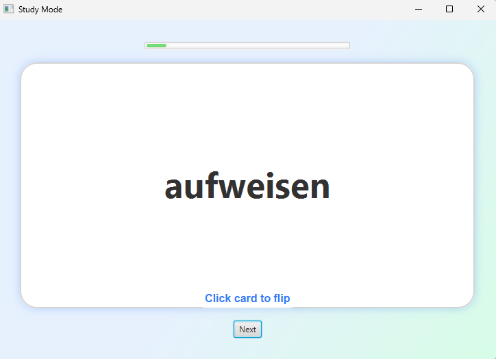

# 📚 Flashcard App

The Flashcard App is a lightweight, interactive JavaFX application designed to help users study using digital flashcards. It allows you to load flashcards dynamically from an SQLite database, flip between front and back sides with a click, and move through a deck one card at a time.

The UI is clean, responsive, and adapts to different window sizes. It visually emphasizes the current flashcard, encourages active recall, and provides an intuitive learning experience.

You can choose your dataset by selecting tables and columns directly from your database, making the app flexible and adaptable to many subjects such as vocabulary, trivia, or academic facts.

---

## ✨ Features

- 🔄 Flip flashcards interactively
- 📁 Load any table and columns from an SQLite DB
- 💡 Modern, responsive UI
- ✅ Tested with **JUnit4** and **TestFX**
- 🔀 Cross-platform (Windows/Linux)
- ⚙️ Built with **Java 24**, JavaFX 21, and Maven

---

## 📸 Screenshot



---

## 🚀 Getting Started

### Prerequisites

- Java 24+
- Maven (`mvn` or `mvnd`)
- VS Code or any Java IDE
- SQLite DB with at least one table

### Project Setup

```bash
git clone https://github.com/<your-username>/flashcard-app.git
cd flashcard-app
mvnd clean javafx:run
```

## 🧪 Running Tests

Includes:
- Unit tests for core logic (Deck, Flashcard, DatabaseManager)
- Integration/UI tests using TestFX (StudyView, TableSelectorDialog)

Run all tests:
```bash
mvnd test
```

To run only a specific test class:
```bash
mvnd -Dtest=StudyViewTest test
```

## 🛠️ Replace the Database
To use your own data, replace the default SQLite database file (flashcards.db) inside the data/ directory with your own file. The app will prompt you to choose the table and columns (e.g., "front" and "back") when you launch it.

## 📁 Folder Structure
```bash
flashcard-app/
├── .github/
│   └── workflows/
│       └── maven.yml
├── data/
│   └── flashcards.db           <-- Replace this with your own database file
├── docs/
├── src/
│   ├── main/
│   │   └── java/
│   │       └── com/hemrajchauhan/flashcardapp/
│   │           ├── db/
│   │           │   └── DatabaseManager.java
│   │           ├── model/
│   │           │   ├── Deck.java
│   │           │   └── Flashcard.java
│   │           ├── ui/
│   │           │   ├── StudyView.java
│   │           │   └── TableSelectorDialog.java
│   │           └── App.java
│   └── test/
│       └── java/
│           └── com/hemrajchauhan/flashcardapp/
│               ├── db/
│               │   └── DatabaseManagerTest.java
│               ├── model/
│               │   ├── DeckTest.java
│               │   └── FlashcardTest.java
│               └── ui/
│                   ├── StudyViewTest.java
│                   └── TableSelectorDialogTest.java
├── .gitignore
├── pom.xml
```

## 🧪 GitHub Actions CI
CI is configured for:
- Ubuntu (uses xvfb to support JavaFX tests)
- Windows
Runs on every push to main or dev.

## 📃 License
MIT License. See LICENSE file.

## 🙋 Contributing
Contributions are welcome! Open a PR or submit an issue.
